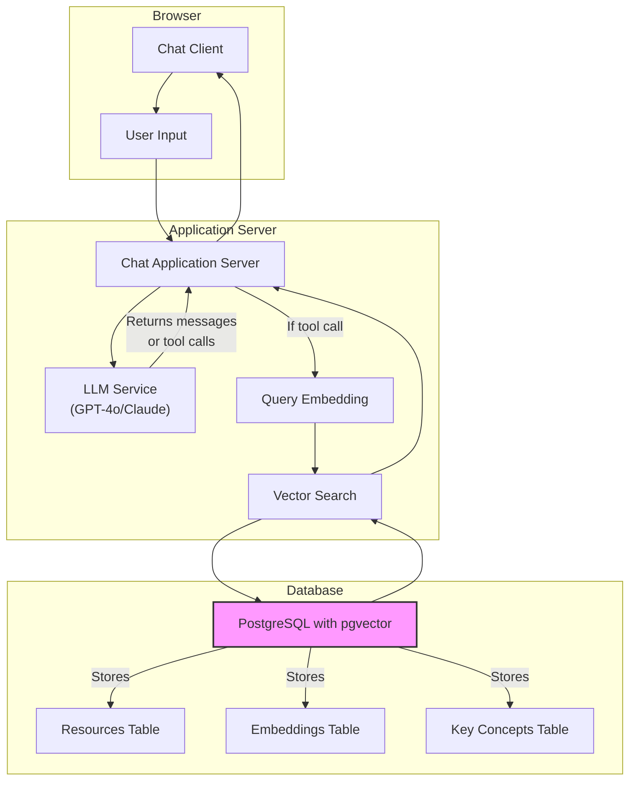

# Nature Finance RAG client for working with IMF climate development reports

This is a RAG application for IMF climate development reports. It is built with Next.js, Shadcn UI, and Vercel AI SDK, with a Postgres vector database to store embeddings and retrieve relevant content.

## Getting Started

1. Clone the repository with `git clone https://github.com/Teal-Insights/nature-finance-rag-client && cd nature-finance-rag-client`
2. Run `npm install` to install the dependencies
3. Run `docker compose up` to start the Postgres database
4. Run `npm run db:migrate` to migrate the database
5. Run `npm run ingest:pdfs` to ingest the PDFs

## Implementation

The text is chunked into paragraphs, with a max chunk length of 2500 characters.

## Chatting with the RAG application

To chat with the RAG application, run the following command:

```bash
npm run dev
```

## Tech Stack

Here's a breakdown of the tech stack, along with Mermaid diagrams representing the ingestion/database and client logic.

**Overall Tech Stack**

*   **Framework:** Next.js
*   **UI Library:** Shadcn UI, Radix UI React
*   **Language:** TypeScript
*   **Database:** PostgreSQL with pgvector extension
*   **ORM:** Drizzle ORM
*   **AI/Embeddings:** OpenAI embeddings (using `@ai-sdk/openai` and `ai` libraries)
*   **PDF Processing:** `pdf-parse`
*   **Environment Variables:** `@t3-oss/env-nextjs`



**1. Ingestion/Database Logic**

*   **Ingestion Script (ingest-pdfs.ts):**  The entry point for the data ingestion process. It takes a file path or directory path as input.
*   **PDF Processor (pdf-processor.ts):**  Handles the extraction of text from PDFs using `pdf-parse`, chunks the text, generates embeddings, and stores the text and embeddings in the database.
*   **pdf-parse:** Used to parse the pdfs.
*   **Chunking Logic:** Logic within the PDF Processor to split text into manageable chunks.
*   **@ai-sdk/openai (embedding generation):**  Uses OpenAI's API to generate embeddings for the text chunks.
*   **Drizzle ORM:**  An ORM used to interact with the PostgreSQL database.
*   **PostgreSQL with pgvector:**  PostgreSQL database with the `pgvector` extension enabled to store and perform similarity searches on embeddings.
*   **Resources Table:** Stores the original text content of the PDFs.
*   **Embeddings Table:** Stores the text chunks and their corresponding embeddings.

**2. Client Logic**

*   **Client (app/page.tsx):** This is the main React component for the chat interface.  It uses the `@ai-sdk/react` library.
*   **@ai-sdk/react (useChat hook):** A hook that manages the chat state, including messages, input, and handling user input.
*   **User Input:**  The text entered by the user in the chat interface.
*   **app/api/chat/route.ts:**  A Next.js API route that handles the chat logic.
*   **@ai-sdk/openai (gpt-4o):**  Uses OpenAI's API to generate responses based on the user's input and the relevant content retrieved from the database.
*   **Tools (addResource, getInformation):** Functions that the AI can use to interact with the system, the ai sdk provides methods to use these tools.
*    **addResource (actions/resources.ts):** Adds a resource, called by the ai's tools to add pieces of knowledge to the RAG database.
*   **findRelevantContent (ai/embedding.ts):**  Retrieves the most relevant content from the database based on the user's query using cosine similarity.
*   **Drizzle ORM:**  An ORM used to interact with the PostgreSQL database.
*   **PostgreSQL with pgvector:**  PostgreSQL database with the `pgvector` extension enabled to store and perform similarity searches on embeddings.  This is where the vector similarity search happens.
*   **Embeddings Table:**  Stores the text chunks and their corresponding embeddings. `findRelevantContent` queries this table.
*   **Relevant Content:** The chunks that are most similar to the user's query.